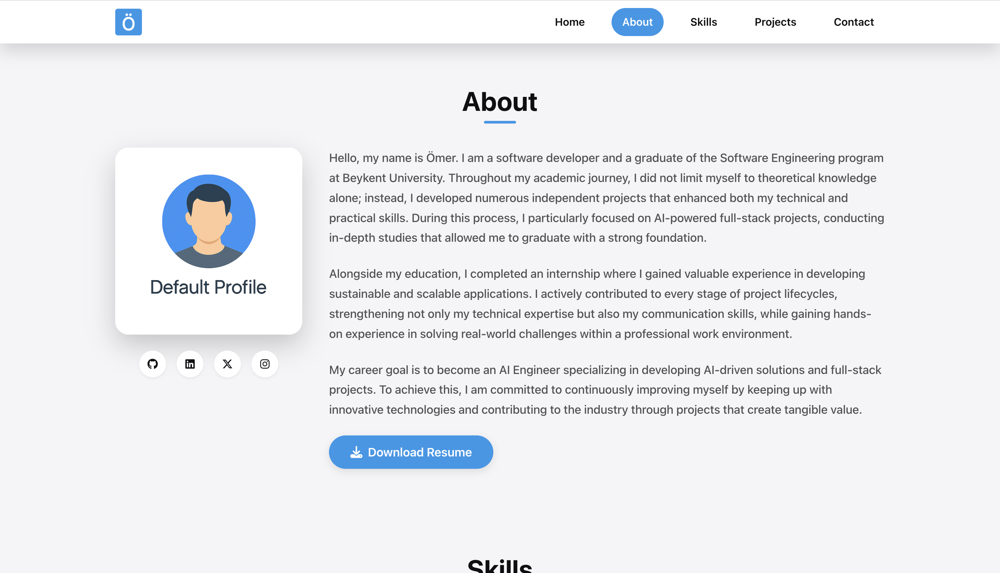
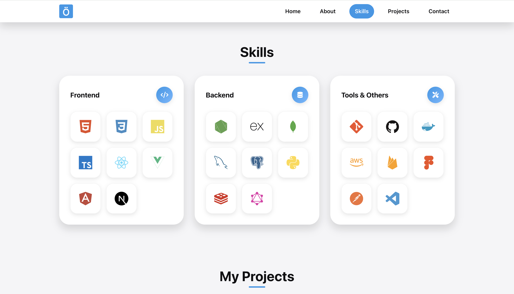
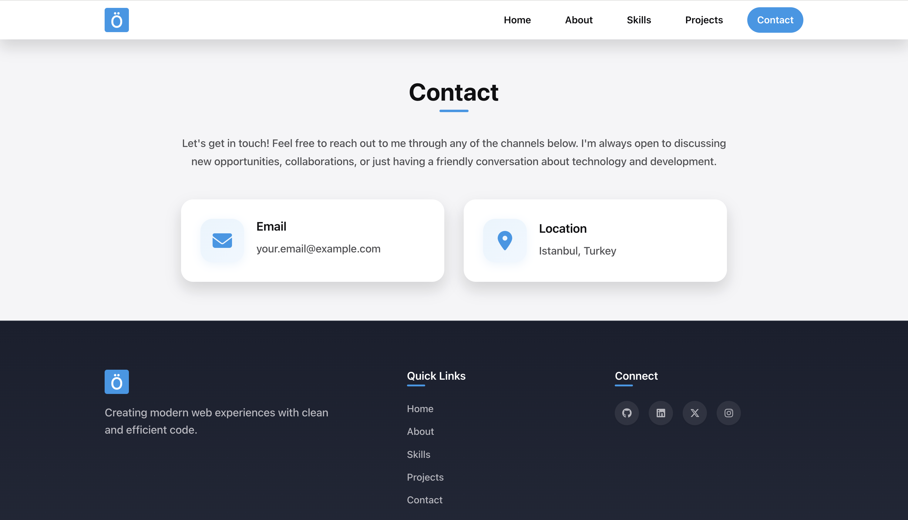

# Portfolio Website

## Description

A sleek and professional personal portfolio website designed to showcase career achievements, development skills, project work, and contact information. Built with semantic HTML5, custom CSS3, and interactive JavaScript, using only core frontend technologies without external frameworks.

## Live Site

[View Portfolio Website](https://omeroztprk.github.io)

## Features

- **Responsive Design**: Seamlessly adapts across all devices from mobile phones to large desktop screens
- **Mobile Navigation**: Touch-friendly hamburger menu with smooth transitions
- **Dynamic Content Rendering**: Modular JavaScript architecture for maintainable and scalable code structure
- **Typewriter Effect**: Dynamic text animation showcasing multiple professional roles in home section
- **Scroll Spy Navigation**: Active section highlighting based on scroll position
- **Skills Showcase**: Categorized technology stack display with interactive tooltips and hover effects
- **Interactive Project Gallery**: Advanced filtering system with category-based organization and pagination
- **Project Modal System**: Detailed project views with image galleries, thumbnails, and comprehensive descriptions
- **Contact Integration**: Direct email links and location information for easy communication
- **Smooth Animations**: Custom CSS animations and transitions without external libraries
- **SEO Optimized**: Semantic HTML structure for better search engine performance
- **Accessibility Compliant**: ARIA labels, keyboard navigation, focus management, and screen reader support

## Screenshots

<table>
  <tr>
    <td align="center">
      <a href="assets/images/screenshots/home.png">
        
      </a><br/><sub>Home</sub>
    </td>
    <td align="center">
      <a href="assets/images/screenshots/about.png">
        
      </a><br/><sub>About</sub>
    </td>
    <td align="center">
      <a href="assets/images/screenshots/skills.png">
        
      </a><br/><sub>Skills</sub>
    </td>
  </tr>
  <tr>
    <td align="center">
      <a href="assets/images/screenshots/projects.png">
        
      </a><br/><sub>Projects</sub>
    </td>
    <td align="center">
      <a href="assets/images/screenshots/project-details.png">
        
      </a><br/><sub>Project Details</sub>
    </td>
    <td align="center">
      <a href="assets/images/screenshots/contact.png">
        
      </a><br/><sub>Contact</sub>
    </td>
  </tr>
</table>

## Installation

1. Clone the repository
    ```bash
    git clone https://github.com/omeroztprk/portfolio-website.git
    ```

2. Navigate to the project directory
    ```bash
    cd portfolio-website
    ```

3. Open the project in your preferred code editor
    ```bash
    code .
    ```

## Customization

### Personal Information
Edit the `js/data.js` file to customize your personal information:

```javascript
// Update home section
window.HOME_DATA = {
  name: "Your Name",
  title: "Your Title",
  description: "Your description",
  typewriter: ["Role 1", "Role 2", "Role 3"]
};

// Update about section
window.ABOUT_DATA = {
  profileImage: "path/to/your/image.jpg",
  description: ["Your bio paragraphs..."],
  resumeLink: "path/to/your/resume.pdf"
};
```

### Social Media Links
Update your social media profiles in the `SOCIAL_DATA` section:

```javascript
window.SOCIAL_DATA = [
  {
    name: "GitHub",
    url: "https://github.com/yourusername",
    icon: "fab fa-github",
    class: "icon-github"
  }
  // Add more social links...
];
```

### Skills and Technologies
Modify the skills section to reflect your technology stack:

```javascript
window.SKILLS_DATA = [
  {
    id: "frontend",
    title: "Frontend",
    icon: "fas fa-code",
    skills: [
      { name: "Technology", icon: "devicon-tech-plain colored", tooltip: "Technology" }
      // Add your skills...
    ]
  }
];
```

### Projects
Add your projects in the `PROJECTS_DATA` section:

```javascript
{
  id: "project-id",
  title: "Project Title",
  description: ["Project description paragraphs..."],
  cover: "path/to/cover/image.png",
  images: ["path/to/image1.png", "path/to/image2.png"],
  categories: ["frontend"], // or ["backend"], ["fullstack"], etc.
  tags: ["HTML", "CSS", "JavaScript"],
  live: "https://your-live-demo.com",
  repo: "https://github.com/username/repo",
  badges: ["featured"] // optional: ["new"], ["featured"]
}
```

### Colors and Styling
Customize the color scheme by modifying CSS custom properties in `css/styles.css`:

```css
:root {
  --color-primary: #2198e9;
  --color-primary-dark: #2878b3;
  --color-primary-light: #6cb9ff;
  /* Modify other color variables... */
}
```

### Assets
Replace the following assets with your own:
- `assets/images/logo.png` - Your logo
- `assets/images/profile.jpg` - Your profile picture
- `assets/images/favicon.ico` - Your favicon
- `assets/resume.pdf` - Your resume
- Project images in `assets/images/projects/` folders

## Running the Application

```bash
# Using Python 3
python -m http.server 8000

# Using Node.js (http-server)
npx http-server

# Using Live Server extension in VS Code
# Right-click on index.html and select "Open with Live Server"
```

## License

This project is licensed under the MIT License - see the [LICENSE](LICENSE) file for details.

---

**Note**: This portfolio template is designed to be easily customizable. Simply update the data files with your information and replace the assets with your own content.